# long_form_tts

[](https://www.python.org/downloads/)
[](LICENSE)

Convert PDFs and web articles into audiobooks or two-speaker podcast episodes — **fully local, no cloud APIs required**. Runs entirely on your own hardware using local LLMs (Ollama / MLX) and local TTS (Kokoro / Chatterbox).

> **Note:** This is a proof-of-concept project, not production-ready software. It has only been tested on a MacBook Pro M1 Max with 64 GB of RAM. Expect rough edges — contributions and bug reports are welcome.

## What it does

Two pipelines share the same content extraction and audio assembly but differ in content generation:

- **Audiobook** — single-narrator narration adapted from the source text by an LLM, rendered with Kokoro TTS
- **Podcast** — two-speaker conversational dialogue generated from an LLM-produced outline, rendered with Kokoro or Chatterbox TTS

Both pipelines accept **local PDFs**, **PDF URLs**, or **web page URLs** as input. They are resumable per stage: each stage caches its output to disk, so you can interrupt a run, re-launch with the same output directory, and it picks up from the last completed stage.

### Audiobook pipeline

```mermaid
flowchart LR
    A[PDF / URL] --> B[TOC Analysis\n& Extraction]
    B --> C[Markdown\nConversion]
    C --> D[LLM Narration\nAdaptation]
    D --> E[Kokoro TTS]
    E --> F[🔊 audiobook.wav]
```



### Podcast pipeline

```mermaid
flowchart LR
    A[PDF / URL] --> B[TOC Analysis\n& Extraction]
    B --> C[Markdown\nConversion]
    C --> D[LLM Outline\nGeneration]
    D --> E[LLM Dialogue\nGeneration]
    E --> G[Intro / Outro\nGeneration]
    G --> H[Multi-Speaker TTS\nKokoro / Chatterbox]
    H --> I[🔊 podcast.wav]
```



## Quick start

```bash
# Install dependencies
uv sync

# TTS on Apple Silicon (Kokoro + Chatterbox)
uv sync --extra mlx

# TTS on CUDA / CPU
uv sync --extra torch

# Pull a local LLM (if using Ollama)
ollama pull qwen3:14b

# Run from a local PDF
uv run python scripts/audiobook.py -i docs/book.pdf

# Run from a URL (PDF or web page)
uv run python scripts/podcast.py -i https://example.com/article

# Cross-language: read English PDF, produce French audio
uv run python scripts/audiobook.py -i docs/book.pdf --source-lang en --target-lang fr

# Render only specific podcast segments
uv run python scripts/podcast.py -i docs/book.pdf --only intro,1-3,outro

# Resume a partial run (reuses cached stages, --input not needed)
uv run python scripts/audiobook.py -o output/my_run
```

## Requirements

- Python 3.11+
- [uv](https://docs.astral.sh/uv/)
- [Ollama](https://ollama.com/) (for local LLM inference)
- macOS with Apple Silicon (M1/M2/M3/M4) for MLX-based TTS, **or** a CUDA GPU for torch-based TTS

### Hardware

A GPU is required. CPU-only inference is not supported — it is far too slow for practical use. You need either Apple Silicon (for the MLX backend) or an NVIDIA GPU (for the PyTorch backend).

#### TTS model sizes

| Model | MLX (Apple Silicon) | PyTorch (CUDA / CPU) |
|---|---|---|
| Kokoro (82M params) | ~160 MB | ~360 MB |
| Chatterbox (0.5B params) | ~2.6 GB | ~9.6 GB |

#### LLM requirements

The LLM generates narration scripts / podcast dialogues from source text. Either backend works:

- **Ollama** — runs locally or on a remote server. A GPU with ~12–15 GB VRAM is recommended for models like `qwen3:14b`.
- **MLXLLM** (Apple Silicon only) — loads 4-bit quantized models in unified memory (~8–10 GB for Qwen3-14B).

#### Recommended configurations

| Setup | Hardware | Notes |
|---|---|---|
| **Minimum** (Kokoro + Ollama) | NVIDIA GPU or Apple Silicon, 8+ GB RAM | Kokoro is lightweight; Ollama can run on a separate machine |
| **Apple Silicon** (fully local) | M1/M2/M3/M4 Mac, 64 GB unified memory | Metal GPU used automatically; runs TTS + LLM locally with no cloud dependency |
| **NVIDIA GPU** | 10+ GB VRAM (e.g. RTX 3080), 16+ GB RAM | Required for Chatterbox; Kokoro runs on any NVIDIA GPU |

## Configuration

Edit `scripts/configs/audiobook.py` or `scripts/configs/podcast.py` to swap LLM backends, TTS engines, voices, languages, and pipeline parameters. Backend switching is a one-line change:

```python
# Ollama (any model served by Ollama)
llm = OllamaLLM(model="qwen3:14b")

# MLX (Apple Silicon local — HuggingFace MLX weights)
llm = MLXLLM(model="Qwen/Qwen3-14B-MLX-4bit")
```

## Documentation

### Getting started

- [Getting Started](docs/getting_started/getting_started.md) — installation, first run, configuration
- [Sample PDFs](docs/getting_started/sample_pdfs.md) — free PDFs for testing the pipelines

### Architecture & pipelines

- [Architecture](docs/architecture/architecture.md) — pipeline design, package map, key decisions
- [Audiobook Pipeline](docs/architecture/audiobook_pipeline.md) — 5-stage audiobook walkthrough with caching details
- [Podcast Pipeline](docs/architecture/podcast_pipeline.md) — 7-stage podcast walkthrough with caching details

### Backends & features

- [PDF Backends](docs/backends/pdf_backends.md) — pymupdf vs docling comparison
- [TTS Backends](docs/backends/tts_backends.md) — Kokoro vs Chatterbox comparison
- [TOC Analysis](docs/backends/toc_analysis.md) — document splitting and section detection
- [Translation](docs/backends/translation.md) — cross-language generation, voice auto-selection

### Reference

- [API Reference](docs/reference/api_reference.md) — all public functions, config classes, and data types
- [Troubleshooting](docs/reference/troubleshooting.md) — common errors and how to fix them

## Known limitations

**Qwen3-TTS:** Qwen3-TTS support was explored but removed due to unresolvable package conflicts — `mlx-audio >= 0.3.0` (required for Qwen3-TTS) depends on `transformers == 5.0.0rc3` (pre-release), which conflicts with `docling`'s `huggingface-hub < 1` pin. This will be revisited once upstream packages publish compatible stable releases. See [research/replace-dia-with-qwen3-tts.md](research/replace-dia-with-qwen3-tts.md) for details.

## Contributing

Contributions are welcome! Please see [CONTRIBUTING.md](CONTRIBUTING.md) for guidelines.

## Author

**Ravidhu Dissanayake** — [LinkedIn](https://www.linkedin.com/in/ravidhu/) · [GitHub](https://github.com/ravidhu)

## License

This project is licensed under the MIT License — see the [LICENSE](LICENSE) file for details.
