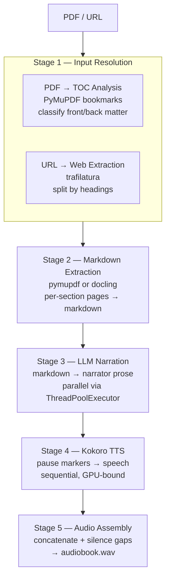
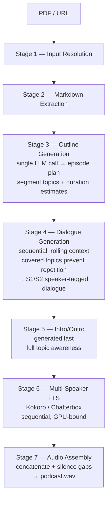
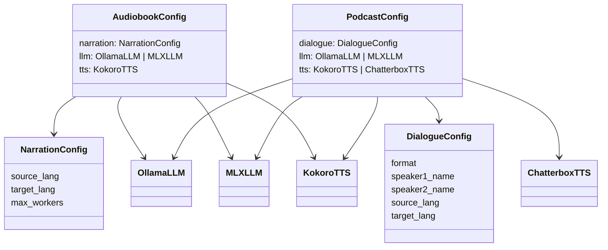

# Architecture

## Pipelines

Two pipelines share the same content extraction and audio assembly stages but differ in content generation. Both accept local PDFs, PDF URLs, or web page URLs as input.

### Audiobook Pipeline



### Podcast Pipeline



## Package Map

```
src/
├── shared/                 # Shared packages (used by both pipelines)
│   ├── providers/          # LLM and TTS provider configs
│   │   ├── llm.py          # LLM backend configs + llm_generate()
│   │   ├── tts.py          # TTS backend configs
│   │   └── runtime.py      # TTS runtime detection (mlx vs torch)
│   │
│   ├── pdf_parser/         # Stage 1 + 2
│   │   ├── types.py        # Shared dataclasses (TOCEntry, ContentRange, TOCSection)
│   │   ├── classify_entry.py # Front/back/preamble/content classification
│   │   ├── extract_toc.py  # Embedded TOC extraction via PyMuPDF
│   │   ├── infer_toc.py    # Docling-based TOC inference (no embedded TOC)
│   │   ├── resolve_content.py # Content page range + section splitting
│   │   ├── convert.py      # Backend dispatcher
│   │   ├── _convert_pymupdf.py # pymupdf4llm backend
│   │   └── _convert_docling.py # Docling backend
│   │
│   ├── markdown_parser/    # Section dataclass + markdown splitting
│   │   └── parse_markdown.py # Section dataclass + parse_markdown()
│   │
│   ├── web_parser/         # Web page input (alternative to PDF)
│   │   ├── fetch_url_content.py # Download + extract via trafilatura
│   │   └── split_by_headings.py # Split markdown by heading level
│   │
│   └── audio_assembler/    # Stage 5/7
│       └── assemble_audiobook.py # Concatenation + silence insertion + wav output
│
├── audiobook/              # Audiobook pipeline: Stages 3-4
│   ├── config.py           # NarrationConfig, AudiobookConfig
│   ├── adapt.py            # LLM narration adaptation
│   ├── prompts.py          # Prompt loader (reads from prompts/)
│   ├── prompts/            # Markdown prompt files
│   │   └── narration_system.md
│   ├── render.py           # Multi-backend rendering (dispatch)
│   ├── _tts_mlx.py         # MLX adapter (Apple Silicon)
│   └── _tts_torch.py       # PyTorch adapter (CUDA/ROCm/CPU)
│
└── podcast/                # Podcast pipeline: Stages 3-6
    ├── config.py           # DialogueConfig, PodcastConfig
    ├── prompts.py          # Prompt loader (reads from prompts/)
    ├── prompts/            # Markdown prompt templates
    │   ├── outline_system.md
    │   ├── dialogue_two_hosts.md
    │   ├── dialogue_host_guest.md
    │   ├── intro.md
    │   ├── outro.md
    │   └── summary.md
    ├── generate.py         # Outline, dialogue, intro/outro generation
    └── render.py           # Multi-speaker TTS (dispatch)
```

## Composable Config System

Both pipelines use the same backend-specific config classes from [`src/shared/providers/`](../src/shared/providers/):

```python
# LLM backends — swap class to switch provider (all local, no cloud APIs)
OllamaLLM(model, url, num_ctx, temperature, timeout, num_predict, top_k, top_p, repeat_penalty, stop)
MLXLLM(model, max_tokens, temperature)   # local on Apple Silicon via mlx-lm

# TTS backends — swap class to switch engine
KokoroTTS(voices=(...,), speed)         # 1 voice (audiobook) or 2 (podcast)
ChatterboxTTS(audio_prompts, lang)      # multilingual, voice cloning
```

Top-level configs compose these — no dead fields, each backend class only has the parameters relevant to that backend:



## Key Design Decisions

### Input & extraction (Stages 1-2)

#### TOC-driven section splitting

The PDF's embedded bookmarks (read via `PyMuPDF.get_toc()`) are the single source of truth for document structure. The TOC analysis happens *before* markdown conversion — it operates on the PDF's bookmark tree, not on any converted text. This means section boundaries are determined by the author's own structure, independent of how the markdown backend formats its output.

1. Classifies each bookmark as **front matter**, **back matter**, **preamble**, or **content** using regex patterns on the title
2. Resolves the content page range (first preamble/content entry → last entry before back matter)
3. Splits content into sections with page ranges via [`resolve_content_sections(max_level)`](../src/shared/pdf_parser/resolve_content.py)

Markdown conversion then runs per-section (`pdf_to_markdown(path, pages=[start..end])`), so each section's content is extracted independently using the page range from the TOC.

**Page boundary bleed**: Since PDF bookmarks point to pages (not byte offsets within a page), a page where a new chapter starts may also contain the last paragraph of the previous chapter. The previous section's page range ends one page *before* the bookmark, so that trailing content goes to the next section's markdown, not the previous one's. No post-processing trims this bleed — for a 10-30 page section, a few stray sentences at the boundary are negligible, and the downstream LLM naturally ignores or incorporates them as a transition.

**Web URLs — heading-based splitting**: Web pages have no bookmark tree, so the pipeline uses a different strategy. The page is first downloaded and converted to markdown via [trafilatura](../src/shared/web_parser/fetch_url_content.py) rather than a generic HTML parser like BeautifulSoup. The distinction matters: BeautifulSoup parses the DOM but leaves you to figure out which `<div>` is the article versus the navbar, sidebar, footer, or cookie banner — logic that varies wildly per site. trafilatura is a *content extractor* — it identifies the main article body, strips boilerplate, and outputs clean markdown in one call. Once the markdown is extracted, [`split_by_headings(markdown, max_level=2)`](../src/shared/web_parser/split_by_headings.py) splits on `#` and `##` headings to produce sections. Text before the first heading becomes an "Introduction" section; if no headings are found at all, the entire article is returned as a single "Full article" section.

#### Configurable PDF backends

Two backends behind a single [`pdf_to_markdown(path, backend=)`](../src/shared/pdf_parser/convert.py) interface:

| Backend | Speed | Quality | GPU | License |
|---|---|---|---|---|
| `pymupdf` | Very fast | Good | No | AGPL-3.0 |
| `docling` | Moderate | Very good | Recommended | MIT |

Backends are lazy-imported — only the selected one is loaded.

### LLM generation (Stages 3-5)

#### Unified LLM dispatch

[`llm_generate(system, prompt, llm)`](../src/shared/providers/llm.py) dispatches on `isinstance(llm, ...)`:

- `OllamaLLM` → `requests.post` to local Ollama `/api/generate` (with preflight check, timeout, and retry)
- `MLXLLM` → `mlx-lm` local inference on Apple Silicon (lazy-imported, model cached in memory)

Both pipelines use this same function. All inference runs locally — no cloud APIs.

#### Prompt management

All LLM prompts are stored as standalone markdown files under `prompts/` directories co-located with the code that uses them:

- `audiobook/prompts/` — narration system prompt
- `podcast/prompts/` — outline, dialogue (two formats), intro, outro, and rolling summary prompts

Each `prompts.py` module is a thin loader that reads the markdown files at import time and exposes them as module-level constants:

```python
_PROMPTS_DIR = Path(__file__).parent / "prompts"

def _load_prompt(name: str) -> str:
    return (_PROMPTS_DIR / name).read_text().strip()

NARRATION_SYSTEM_PROMPT = _load_prompt("narration_system.md")
```

Template prompts (dialogue, intro, outro, summary) use `{placeholder}` syntax — the loaded string is passed through `str.format()` at call time with speaker names, word targets, etc. Plain prompts (narration, outline) are used as-is. In both cases, a dynamic `language_instruction()` suffix is appended for cross-language pairs.

This keeps prompt content editable without touching Python code — useful for iterating on prompt engineering.

#### Ollama robustness

The Ollama integration includes three layers of protection for long pipeline runs (30+ LLM calls):

1. **Preflight check** ([`ollama_preflight`](../src/shared/providers/llm.py)) — verifies Ollama is reachable and the model is pulled before any processing begins. Cached per `(url, model)` pair. Called at startup in both scripts.
2. **Timeout** — configurable per-request timeout (default 600s / 10 min) to avoid hanging on unresponsive Ollama instances.
3. **Retry with backoff** — 3 attempts with exponential backoff (4s, 16s) on connection errors, timeouts, and 5xx responses. 4xx errors fail immediately.

#### Podcast dialogue strategy

The first version of the podcast pipeline used a classic MapReduce approach: chunk the document into ~3000-token pieces, summarize each chunk independently in parallel, then feed all summaries into a single LLM call to produce the dialogue script. It was fast — the MAP phase was parallelizable — but the output had a recurring problem: the podcast kept repeating itself.

The root cause was that each chunk was summarized in isolation. When two chunks from the same section both mentioned a key concept, both summaries included it, and the downstream dialogue generation had no way to know it had already covered that point three segments ago. For a 45-90 minute podcast, this compounded into noticeable repetition and a lack of narrative arc. Worse, for large documents (500+ pages), even the summaries didn't fit in one context window, requiring recursive summarization that further degraded signal.

The fix was to invert the order: **plan globally first, then execute locally**. Instead of trying to reconstruct coherence from independently-produced summaries, the pipeline now invests one LLM call upfront to create a shared episode plan, then generates dialogue segment-by-segment with rolling context that tracks what's already been said.


1. **Global outline** — single LLM call reads section previews (~2000 chars each), produces a structured episode plan with segment topics and duration estimates
2. **Per-segment dialogue** — each segment receives: outline (constant) + rolling summary + covered topics + full source content. The covered topics list acts as a "do not repeat" constraint
3. **Rolling summary** — Chain-of-Density style, updated after each segment (~500 words). Keeps the LLM aware of what's been said without needing the full prior dialogue in context
4. **Intro/outro** — generated last, with full awareness of all topics covered, so they can accurately tease and recap the content

The trade-off is that dialogue generation is now sequential (each segment depends on the previous rolling summary), but planning is cheap (one LLM call) and coordination — which was the hard problem — is solved by design rather than by post-hoc stitching.

#### Parallelism strategy

- **Audiobook LLM adaptation**: Parallel via `ThreadPoolExecutor`
- **Podcast dialogue generation**: Sequential — each segment depends on the previous rolling summary
- **All TTS rendering**: Sequential — GPU-bound, parallelizing gives no speedup

### Audio rendering (Stages 4-7)

#### Cross-platform TTS

TTS rendering supports two runtimes with automatic detection:

- **MLX** (Apple Silicon) — `mlx-audio` with Metal GPU acceleration
- **PyTorch** (CUDA/ROCm/CPU) — `transformers` + `kokoro` PyPI package

The runtime is selected by [`get_tts_runtime()`](../src/shared/providers/runtime.py): checks `TTS_RUNTIME` env var first, then auto-detects based on `mlx_audio` importability. Each renderer module ([`audiobook/render.py`](../src/audiobook/render.py), [`podcast/render.py`](../src/podcast/render.py)) uses `_get_backend()` to lazy-import the correct adapter (`_tts_mlx.py` or `_tts_torch.py`). All render logic (pause splitting, speaker parsing, chunk merging) is shared — only model loading and `generate()` calls differ.

#### Explicit model loading

TTS models are loaded once via `load_tts_model()` and passed explicitly to rendering functions. No hidden global state.

### Output & observability

#### Per-run logging

Both scripts set `sys.stdout = TeeLogger(log_path)` right after argparse, so every `print()` call writes to both the terminal and a timestamped log file inside the output directory. The log file is opened in append mode with line buffering (`buffering=1`), so each line is flushed to disk immediately — even a hard crash only loses the line being written.

Resuming a run creates a new log file, giving a full history of all invocations.

#### Output structure

```
output/
├── run_20260208_151927.log  # Per-run log (one per invocation)
├── run_20260208_162000.log  # Second run (e.g. resumed after interrupt)
├── sections/            # Per-section markdown files
│   ├── 00_Foreword.md
│   └── ...
├── narrations/          # Audiobook: LLM-adapted narration scripts
│   ├── 00_narration.txt
│   └── ...
├── dialogue/            # Podcast: dialogue segments
│   ├── 00_intro.txt
│   ├── 01_Foreword.txt
│   ├── ...
│   └── 99_outro.txt
├── audio/               # Per-segment wav files
│   ├── 00_audio.wav
│   └── ...
├── podcast_outline.md   # Podcast: episode outline
├── audiobook.wav        # Audiobook: final assembled audio
└── podcast.wav          # Podcast: final assembled audio
```

Each intermediate artifact is saved to disk, making it easy to inspect, re-run individual stages, or swap out components.
