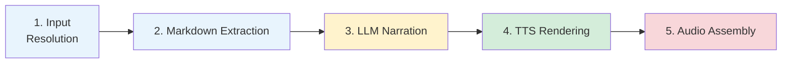

# Audiobook Pipeline (5 stages)

Each stage is **resumable** — if a run is interrupted, re-running with the same `--output` directory skips completed stages automatically (cached files are detected on disk).



> Stages are color-coded: blue = extraction, yellow = LLM, green = TTS, red = assembly. Each stage caches its output — re-running skips completed stages.

```
uv run python scripts/audiobook.py -i book.pdf -o output/my_run
```

---

### Stage 1: Input Resolution & Content Extraction

**What it does**: Resolves the input (local PDF, PDF URL, or web page URL) and determines the document's structure.

**Input types**:
- **Local PDF** → TOC analysis and section resolution (below)
- **PDF URL** → Downloaded and cached in `inputs/`, then processed as a local PDF. GitHub blob URLs are auto-rewritten to raw download URLs.
- **Web page URL** → Fetched via trafilatura, content split by headings into sections (requires `[web]` extra)

**How it works** (PDF path):
1. Embedded bookmarks are extracted via `PyMuPDF.get_toc()`. If bookmarks are missing or cover less than 30% of the document, the pipeline falls back to Docling AI layout analysis to detect headings from font sizes and section numbering.
2. Each bookmark is classified by regex on its title:
   - **Front matter** (skipped): Cover, Title Page, Copyright, Table of Contents, etc.
   - **Back matter** (skipped): Index, Glossary, Bibliography, Appendix, etc.
   - **Preamble** (included): Foreword, Preface, Introduction, Acknowledgments
   - **Content** (included): everything else
3. `resolve_content_sections(max_level)` splits content into sections with page ranges
4. Sections that exceed `CONTEXT_BUDGET` tokens are auto-subdivided

**Output**: A list of sections in memory, each with a title and page range. Nothing is written to disk yet.

**Key config**: `MAX_TOC_LEVEL` (`2` for audiobook), `CONTEXT_BUDGET` — see [TOC Analysis — Section splitting](../backends/toc_analysis.md#section-splitting) for how these interact (level-based splitting, auto-subdivision of oversized sections, page-level chunking fallback). The audiobook uses level 2 (chapter-granularity) because each chapter is narrated independently with no cross-section context.

---

### Stage 2: Markdown Extraction

**What it does**: Converts each section's PDF pages into markdown text.

**How it works**:
1. For each section, the page range is passed to `pdf_to_markdown(pdf_path, backend, pages)`
2. The selected backend extracts text, tables, and structure into markdown
3. Each section is saved as a separate `.md` file in `sections/`
4. Structural features are detected: `has_table` (pipe + dashes), `has_list` (bullet/numbered patterns)

**Backends**:
| Backend | Speed | Quality | Notes |
|---|---|---|---|
| `pymupdf` | Very fast | Good | Default, no GPU needed |
| `docling` | Moderate | Very good | Better section detection |

**Output**: `sections/00_Foreword.md`, `sections/01_Chapter_1.md`, etc.

**Cache**: If a section's `.md` file already exists, it's loaded from disk instead of re-extracted.

**Key config**: [`PDF_PARSER_BACKEND`](../reference/api_reference.md#pdf_to_markdownpdf_path-backendpymupdf-pagesnone---str)

---

### Language propagation

Setting `source_lang` and `target_lang` in `NarrationConfig` is all you need — the pipeline propagates them automatically:

1. **LLM prompts**: A `language_instruction(source_lang, target_lang)` is appended to the narration system prompt. When `source_lang == target_lang == "en"`, no instruction is added. Otherwise the LLM is told to write in the target language, translating if needed.
2. **TTS voice auto-selection**: If you omit the `tts=` parameter, `AudiobookConfig` creates `KokoroTTS(lang=target_lang)` automatically, picking the correct voice preset for that language.

> **Caveat**: If you set `tts=` explicitly with a specific voice, make sure it matches the target language. For example, `target_lang="fr"` with `KokoroTTS(voices=("af_heart",))` would generate French narration but read it with an American English voice.

See [Translation](../backends/translation.md) for cross-language workflows and examples.

---

### Stage 3: LLM Narration Adaptation

**What it does**: Rewrites each section's markdown into narrator-ready prose suitable for TTS.

**How it works**:
1. Each section is sent to the LLM with the [narration system prompt](../src/audiobook/prompts/narration_system.md)
2. The LLM transforms the content following detailed rules:
   - Tables become flowing comparative sentences
   - Bullet lists become prose with transitions ("First... Additionally... Finally...")
   - Numbers are written as spoken words ("32K" becomes "thirty-two thousand")
   - Code blocks and shell commands are described in plain language instead of read literally
   - All markdown formatting is removed
   - Headers become spoken transitions ("Let's now turn our attention to...")
   - Pause markers are inserted: `[PAUSE_SHORT]`, `[PAUSE_MEDIUM]`, `[PAUSE_LONG]`
3. For French output, English technical terms get phonetic French spelling so the TTS pronounces them correctly (e.g. "Hive" becomes "Haive")
4. Sections are processed in parallel via `ThreadPoolExecutor` (`max_workers` is set in [`NarrationConfig`](../scripts/configs/audiobook.py), default `1`)

**Supported language pairs**: `en→en`, `fr→fr`, `en→fr`, `fr→en`

**Output**: `narrations/00_narration.txt`, `narrations/01_narration.txt`, etc.

**Cache**: If a narration `.txt` file already exists, it's loaded from disk.

**Key config**: [`llm`](../reference/api_reference.md#llm-backends) (backend + model), [`source_lang`, `target_lang`, `max_workers`](../reference/api_reference.md#config-classes)

---

### Stage 4: TTS Rendering

**What it does**: Converts narration text into speech audio using the configured TTS backend.

**How it works**:
1. The TTS model is loaded once (only if there are uncached sections)
2. Each narration is split on pause markers (`[PAUSE_SHORT]`, `[PAUSE_MEDIUM]`, `[PAUSE_LONG]`)
3. Text chunks are synthesized individually, with silence inserted for pauses (0.5s, 1.2s, 2.0s)
4. Each section's audio is saved as a separate `.wav` file
5. Processing is **sequential** — a design choice for simplicity given single-GPU hardware. Sections are independent and could be parallelized with multiple devices (need to change the code for this)

**Output**: `audio/00_audio.wav`, `audio/01_audio.wav`, etc. (24kHz sample rate)

**Cache**: If an audio `.wav` file already exists, it's loaded from disk (the TTS model isn't even loaded if all sections are cached).

**Key config**: [`tts`](../reference/api_reference.md#tts-backends) (voice, speed)

---

### Stage 5: Audio Assembly

**What it does**: Concatenates all section audio files into a single audiobook.

**How it works**:
1. All per-section audio arrays are concatenated in order
2. 2.0 seconds of silence is inserted between each section
3. The final audio is written as a single `.wav` file

**Output**: `audiobook.wav`

**Key config**: [`inter_section_pause`](../reference/api_reference.md#assemble_audiobookaudio_segments-output_path-sample_rate24000-inter_section_pause20---none) (hardcoded at 2.0s)

---

## Caching & Resume

Every stage writes its output to disk before moving on. When you re-run with the same `--output` directory:

| Stage | Cache key | To re-run this stage |
|---|---|---|
| 2. Markdown | `sections/*.md` | Delete the section's `.md` file |
| 3. Narration | `narrations/*.txt` | Delete the `.txt` file(s) |
| 4. Audio | `audio/*.wav` | Delete the `.wav` file(s) |
| 5. Final | `audiobook.wav` | Delete the final file |

To re-run the entire pipeline from scratch, delete the output directory and run again.

## Per-Run Logging

Each invocation creates a timestamped log file (`run_YYYYMMDD_HHMMSS.log`) in the output directory. The log mirrors all terminal output and is line-buffered for crash resilience. Resuming a run creates a new log file, so the output directory accumulates a full history across invocations.
