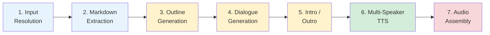
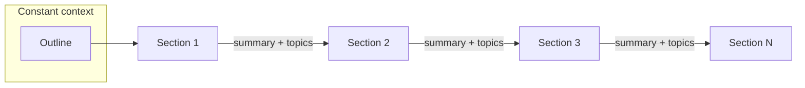

# Podcast Pipeline (7 stages)

Each stage is **resumable** — if a run is interrupted, re-running with the same `--output` directory skips completed stages automatically (cached files are detected on disk).



> Stages are color-coded: blue = extraction, yellow = LLM, green = TTS, red = assembly. Each stage caches its output — re-running skips completed stages.

```
uv run python scripts/podcast.py -i book.pdf -o output/my_podcast
```

### Partial rendering with `--only`

The `--only` flag lets you re-render specific segments without re-running the full pipeline. Useful for fixing a single segment's audio or testing TTS changes:

```bash
# Re-render intro and sections 1-3 only
uv run python scripts/podcast.py --output output/my_podcast --only intro,1-3,outro

# Re-render just section 5
uv run python scripts/podcast.py --output output/my_podcast --only 5
```

Segment numbers are 1-based (matching section order). Use `intro` and `outro` for the opening/closing segments. When `--only` is used, the output file is named `podcast_partial.wav` instead of `podcast.wav`.

---

### Stage 1: Input Resolution & Content Extraction

**What it does**: Resolves the input (local PDF, PDF URL, or web page URL) and determines the document's structure.

**Input types**:
- **Local PDF** → TOC analysis and section resolution (below)
- **PDF URL** → Downloaded and cached in `inputs/`, then processed as a local PDF. GitHub blob URLs are auto-rewritten to raw download URLs.
- **Web page URL** → Fetched via trafilatura, content split by headings into sections (requires `[web]` extra)

**How it works** (PDF path):
1. Embedded bookmarks are extracted via `PyMuPDF.get_toc()`. If bookmarks are missing or cover less than 30% of the document, the pipeline falls back to Docling AI layout analysis to detect headings from font sizes and section numbering.
2. Each bookmark is classified by regex on its title:
   - **Front matter** (skipped): Cover, Title Page, Copyright, Table of Contents, etc.
   - **Back matter** (skipped): Index, Glossary, Bibliography, Appendix, etc.
   - **Preamble** (included): Foreword, Preface, Introduction, Acknowledgments
   - **Content** (included): everything else
3. `resolve_content_sections(max_level)` splits content into sections with page ranges
4. Sections that exceed `CONTEXT_BUDGET` tokens are auto-subdivided

**Output**: A list of sections in memory, each with a title and page range. Nothing is written to disk yet.

**Key config**: `MAX_TOC_LEVEL` (`1` for podcast), `CONTEXT_BUDGET` — see [TOC Analysis — Section splitting](../backends/toc_analysis.md#section-splitting) for how these interact (level-based splitting, auto-subdivision of oversized sections, page-level chunking fallback).

---

### Stage 2: Markdown Extraction

**What it does**: Converts each section's PDF pages into markdown text.

**How it works**:
1. For each section, the page range is passed to `pdf_to_markdown(pdf_path, backend, pages)`
2. The selected backend extracts text, tables, and structure into markdown
3. Each section is saved as a separate `.md` file in `sections/`
4. Structural features are detected: `has_table` (pipe + dashes), `has_list` (bullet/numbered patterns)

**Backends**:
| Backend | Speed | Quality | Notes |
|---|---|---|---|
| `pymupdf` | Very fast | Good | Default, no GPU needed |
| `docling` | Moderate | Very good | Better section detection |

**Output**: `sections/00_Foreword.md`, `sections/01_Chapter_1.md`, etc.

**Cache**: If a section's `.md` file already exists, it's loaded from disk instead of re-extracted.

**Key config**: [`PDF_PARSER_BACKEND`](../reference/api_reference.md#pdf_to_markdownpdf_path-backendpymupdf-pagesnone---str)

---

### Language propagation

Setting `source_lang` and `target_lang` in `DialogueConfig` is all you need — the pipeline propagates them automatically:

1. **LLM prompts**: A `language_instruction(source_lang, target_lang)` is appended to every LLM call (outline, dialogue, intro/outro, rolling summary). When `source_lang == target_lang == "en"`, no instruction is added. Otherwise the LLM is told to write in the target language, translating if needed.
2. **TTS voice auto-selection**: If you omit the `tts=` parameter, `PodcastConfig` creates `KokoroTTS(lang=target_lang)` automatically, picking the correct voice preset for that language.

> **Caveat**: If you set `tts=` explicitly with specific voices, make sure they match the target language. For example, `target_lang="fr"` with `KokoroTTS(voices=("bf_emma", "bm_george"))` would generate French dialogue but read it with British English voices.

See [Translation](../backends/translation.md) for cross-language workflows and examples.

---

### Stage 3: Podcast Outline Generation

**What it does**: Produces a structured episode plan from all sections in a single LLM call.

**How it works**:
1. All section titles and content previews (~2000 chars each) are sent to the LLM with the [outline system prompt](../src/podcast/prompts/outline_system.md)
2. The LLM produces a structured outline with:
   - Episode title
   - Per-segment topics, hooks, and talking points
   - Duration estimates per segment
3. If `target_duration_min` is set, the outline respects the time budget
4. The outline is saved as `podcast_outline.md` and stays constant throughout dialogue generation

**Output**: `podcast_outline.md`

**Cache**: If the outline file exists, it's loaded from disk.

**Key config**: [`target_duration_min`](../reference/api_reference.md#config-classes-1), [`llm`](../reference/api_reference.md#llm-backends)

---

### Stage 4: Dialogue Generation

**What it does**: Generates two-speaker conversational dialogue for each section, sequentially.



**How it works**:
1. Sections are processed **one at a time** in order (not parallelizable — each depends on the previous)
2. For each section, the LLM receives a [dialogue prompt](../src/podcast/prompts/) ([two hosts](../src/podcast/prompts/dialogue_two_hosts.md) or [host+guest](../src/podcast/prompts/dialogue_host_guest.md)) along with:
   - The global outline (constant context)
   - The section's markdown content
   - A rolling summary of everything discussed so far (~500 words, Chain-of-Density style)
   - A list of all topics already covered (prevents repetition)
3. The LLM produces dialogue with `[S1]`/`[S2]` speaker tags
4. After each segment, the LLM also produces an updated rolling summary and updated topic list
5. Both the dialogue and the rolling state (`rolling_summary` + `covered_topics`) are saved to disk

**Output**: `dialogue/01_Chapter_1.txt`, `dialogue/01_state.json`, etc.

**Cache**: If both the dialogue `.txt` and `_state.json` exist for a segment, it's loaded from disk. The rolling summary is restored so subsequent segments can resume correctly.

**Why `MAX_TOC_LEVEL=1`**: The podcast defaults to part-level granularity because dialogue is generated sequentially with a rolling summary — fewer, larger sections give each conversation segment more material to discuss, and auto-subdivision still splits oversized parts when they exceed the context budget.

**Key config**: [`segment_target_words`, `words_per_minute`, `format`, `speaker1_name`, `speaker2_name`](../reference/api_reference.md#config-classes-1)

---

### Stage 5: Intro & Outro Generation

**What it does**: Generates opening and closing dialogue with full awareness of all topics covered.

**How it works**:
1. Generated **after** all content segments, so the LLM knows what was discussed
2. The LLM receives the outline and the complete list of covered topics
3. The [intro prompt](../src/podcast/prompts/intro.md) hooks the listener and previews the episode
4. The [outro prompt](../src/podcast/prompts/outro.md) summarizes key takeaways and wraps up

**Output**: `dialogue/00_intro.txt`, `dialogue/99_outro.txt`

**Cache**: If both files exist, they're loaded from disk.

---

### Stage 6: Multi-Speaker TTS Rendering

**What it does**: Converts `[S1]`/`[S2]`-tagged dialogue into two-speaker audio.

**How it works**:
1. The TTS model is loaded once (only if there are uncached segments)
2. Each dialogue segment (intro + content segments + outro) is rendered to audio
3. The rendering approach depends on the TTS backend:

| Backend | How it handles two speakers |
|---|---|
| **Kokoro** | Dialogue is split by speaker tags, each speaker's lines are rendered with a different voice from the `voices` pair, then interleaved |
| **Chatterbox** | Dialogue is split by speaker tags, each speaker is rendered with a different reference audio file for voice cloning |

4. Processing is **sequential** — a design choice for simplicity given single-GPU hardware. Segments are independent and could be parallelized with multiple devices

**Output**: `audio/00_intro.wav`, `audio/01_Chapter_1.wav`, ..., `audio/99_outro.wav` (24kHz sample rate)

**Cache**: If an audio `.wav` file already exists, it's loaded from disk.

**Key config**: [`tts`](../reference/api_reference.md#tts-backends) (backend choice, voices, speed, audio_prompts)

---

### Stage 7: Audio Assembly

**What it does**: Concatenates all segment audio files into a single podcast episode.

**How it works**:
1. All per-segment audio arrays are concatenated in order (intro first, outro last)
2. 1.5 seconds of silence is inserted between each segment (shorter than audiobook)
3. The final audio is written as a single `.wav` file

**Output**: `podcast.wav`

**Key config**: [`inter_section_pause`](../reference/api_reference.md#assemble_audiobookaudio_segments-output_path-sample_rate24000-inter_section_pause20---none) (hardcoded at 1.5s)

---

## Caching & Resume

Every stage writes its output to disk before moving on. When you re-run with the same `--output` directory:

| Stage | Cache key | To re-run this stage |
|---|---|---|
| 2. Markdown | `sections/*.md` | Delete the section's `.md` file |
| 3. Outline | `podcast_outline.md` | Delete the file |
| 4. Dialogue | `dialogue/*.txt` + `*_state.json` | Delete both files for the segment |
| 5. Intro/Outro | `dialogue/00_intro.txt` + `99_outro.txt` | Delete both files |
| 6. Audio | `audio/*.wav` | Delete the `.wav` file(s) |
| 7. Final | `podcast.wav` | Delete the final file |

To re-run the entire pipeline from scratch, delete the output directory and run again.

## Per-Run Logging

Each invocation creates a timestamped log file (`run_YYYYMMDD_HHMMSS.log`) in the output directory. The log mirrors all terminal output and is line-buffered for crash resilience. Resuming a run creates a new log file, so the output directory accumulates a full history across invocations.
