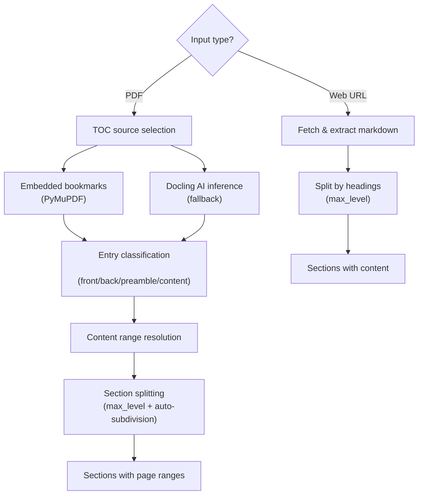
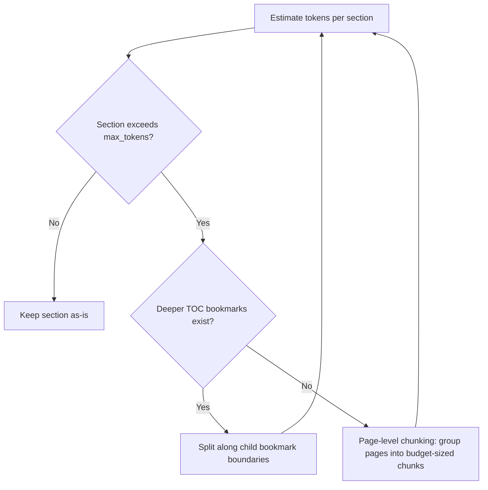

# TOC Analysis & Content Splitting

Both pipelines split input documents into sections before any LLM processing happens. The splitting strategy depends on the input type:

- **PDF** (`src/shared/pdf_parser/`) — TOC-based splitting using embedded bookmarks or Docling AI heading detection. This is the more complex path, covering the bulk of this document.
- **Web URL** (`src/shared/web_parser/`) — heading-based splitting of markdown extracted via [trafilatura](https://github.com/adbar/trafilatura). Simpler, since the content is already structured.



## Contents

- [Web Content Splitting](#web-content-splitting)
  - [Content extraction](#content-extraction)
  - [Heading-based splitting](#heading-based-splitting)
- [PDF TOC Analysis](#pdf-toc-analysis)
  - [TOC source selection](#toc-source-selection)
  - [Page coverage threshold](#page-coverage-threshold)
  - [Embedded TOC extraction](#embedded-toc-extraction)
  - [Docling-based inference](#docling-based-inference)
  - [Entry classification](#entry-classification)
  - [Content range resolution](#content-range-resolution)
  - [Section splitting](#section-splitting)
  - [Key constants](#key-constants)
  - [Data classes](#data-classes)

---

## Web Content Splitting

When the input is a URL (not a PDF), the pipeline uses trafilatura to fetch and extract the page content, then splits it into sections by heading level.

### Content extraction

Implemented in [`fetch_url_content()`](../src/shared/web_parser/fetch_url_content.py).

```python
from shared.web_parser import fetch_url_content

markdown = fetch_url_content("https://example.com/article")
```

`trafilatura.fetch_url()` downloads the page, then `trafilatura.extract()` converts it to markdown with tables and formatting preserved (links and images are excluded). If the page cannot be fetched or yields no extractable content, a `RuntimeError` is raised.

Requires the `[web]` extra: `uv pip install long_form_tts[web]`

### Heading-based splitting

Implemented in [`split_by_headings()`](../src/shared/web_parser/split_by_headings.py).

```python
from shared.web_parser import split_by_headings

sections = split_by_headings(markdown, max_level=2)
# → [WebSection(title="Introduction", content="..."),
#    WebSection(title="Getting Started", content="..."), ...]
```

**How it works**:

1. A regex scans for markdown headings (`#`, `##`, etc.) up to `max_level` depth
2. The text between consecutive headings becomes one section
3. Any text before the first heading is captured as an "Introduction" section
4. If no headings are found at all, the entire text is returned as a single "Full article" section
5. Empty sections (heading with no body) are discarded

Unlike the PDF path, there is no entry classification (front/back matter), no auto-subdivision, and no token budget — web articles are typically shorter and their heading structure maps directly to sections.

**Data class**:

```python
@dataclass
class WebSection:
    title: str     # heading text (without the # prefix)
    content: str   # markdown body between this heading and the next
```

---

## PDF TOC Analysis

The PDF TOC system (`src/shared/pdf_parser/`) determines how a PDF is split into sections. Embedded bookmarks are read via PyMuPDF (fast), and when those are missing or insufficient, Docling AI layout analysis provides heading detection.

### TOC source selection

Implemented in [`_get_toc()`](../src/shared/pdf_parser/resolve_content.py) — selects between two paths based on **page coverage**.

```
_get_toc(pdf_path)
    │
    ├─ extract_toc() → embedded bookmarks
    │   │
    │   └─ Coverage check: max_page / total_pages
    │       ├─ > 30%  → use embedded ✓
    │       └─ ≤ 30%  → fall through ↓
    │
    └─ infer_toc() → Docling layout analysis
```

### Page coverage threshold

The `min_coverage` parameter controls when the embedded TOC is trusted.

**Definition**: `max_page / total_pages`, where `max_page` is the highest 0-indexed page number across all embedded entries.

- If coverage **>= `min_coverage`** → the embedded TOC spans enough of the document to be trustworthy
- If coverage is **below `min_coverage`** (or no entries at all) → fall back to Docling inference

The default is `0.3` (30%). This is configurable via the [`min_coverage`](../reference/api_reference.md#resolve_content_pagespdf_path-min_coverage03---contentrange) parameter on `resolve_content_sections` and `resolve_content_pages` — lower it if your PDF has a legitimate but short-range TOC, raise it if you want to force font-size inference more aggressively.

---

### Embedded TOC extraction

Implemented in [`extract_toc()`](../src/shared/pdf_parser/extract_toc.py) — reads the PDF's built-in outline/bookmarks via `pymupdf.Document.get_toc()`.

```python
entries = extract_toc("book.pdf")
# → [TOCEntry(level=1, title="Part I", page=4), ...]
```

**How it works**:

1. `doc.get_toc()` returns a list of `[level, title, page_1based]` tuples
2. Page numbers are converted from 1-based (PyMuPDF convention) to 0-indexed
3. Entries with negative page numbers (corrupt bookmarks) are filtered out
4. Titles are stripped of leading/trailing whitespace

Returns an empty list if the PDF has no embedded bookmarks.

---

### Docling-based inference

Implemented in [`infer_toc()`](../src/shared/pdf_parser/infer_toc.py) — triggered automatically when no usable embedded TOC exists. Uses [Docling](https://github.com/docling-project/docling) (IBM's AI-based document layout analysis) and is cached via [`@lru_cache`](https://docs.python.org/3/library/functools.html#functools.lru_cache) (a stdlib decorator that memoizes return values by arguments, so repeated calls for the same PDF path skip all the work).

#### Algorithm

**Step 1 — Docling heading detection**: `DocumentConverter().convert(pdf_path)` runs AI layout analysis on the PDF. The resulting document tree is iterated for `TITLE` and `SECTION_HEADER` items, which provide heading text and page numbers. Docling understands document structure semantically — it catches sub-sections (e.g. "1.2.1 Supervised Learning") that font-size methods miss.

**Step 2 — Noise filters**:
- Min length: < 3 chars → discard
- Math/axis labels (e.g. `x(2)`, `f(x)`) → filtered by regex `^[a-z]\(.+\)$` (Docling sometimes detects figure axis labels or math notation as headings in academic PDFs)
- Running headers/footers → titles appearing more than 2 times across the document are discarded
- Duplicates → only the first occurrence of each title is kept

**Step 3 — Hierarchy assignment** — two paths:

| Condition | Strategy | Level assignment |
|-----------|----------|-----------------|
| Majority of headings have section numbers (e.g. `3.1.2`) | **Numbering-based** | dot-count + 1: `"3" → L1`, `"3.1" → L2`, `"3.1.1" → L3`. Unnumbered headings get L1. |
| No section numbering pattern | **Font-size fallback** | Look up each heading's font size in PyMuPDF (match title text on same page). Largest size = L1, all others = L2. |

The numbering threshold is 50% — if more than half of detected headings match the `^\d+(\.\d+)*\s` pattern, numbering-based hierarchy is used.

```python
entries = infer_toc("paper.pdf")
# prints: "Docling detected 136 raw headings."
#         "Using section-numbering for hierarchy."
#         "Inferred 120 TOC entries."
```

---

### Entry classification

Implemented in [`classify_entry()`](../src/shared/pdf_parser/classify_entry.py) — classifies every TOC entry into one of four categories by matching its title against regex patterns (case-insensitive).

#### Front matter (skipped)

Entries before the actual content. These pages are excluded from extraction.

| Pattern | Matches |
|---------|---------|
| `^cover$` | Cover |
| `^half\s*title` | Half Title |
| `^title\s*page` | Title Page |
| `^copyright` | Copyright |
| `^table\s*of\s*contents$` | Table of Contents |
| `^contents$` | Contents |
| `^list\s*of\s*(figures\|tables\|illustrations)` | List of Figures, List of Tables |
| `^dedication` | Dedication |
| `^epigraph` | Epigraph |
| `^praise\b` | Praise for the Book |
| `^endorsements?$` | Endorsements |
| `^also\s*by\b` | Also by Author |
| `^about\s*the\s*cover` | About the Cover |

#### Back matter (skipped)

Entries after the main content. These pages are excluded from extraction.

| Pattern | Matches |
|---------|---------|
| `^index$` | Index |
| `^glossary$` | Glossary |
| `^bibliography$` | Bibliography |
| `^references$` | References |
| `^about\s*the\s*authors?$` | About the Author(s) |
| `^colophon$` | Colophon |
| `^appendix` | Appendix, Appendix A, etc. |

#### Preamble (included as content)

These appear before chapter 1 but contain substantive content worth narrating.

| Pattern | Matches |
|---------|---------|
| `^foreword` | Foreword |
| `^preface` | Preface |
| `^introduction$` | Introduction |
| `^acknowledgments?$` | Acknowledgments |

#### Content

Everything that doesn't match any of the above patterns is classified as **content**.

---

### Content range resolution

Implemented in [`resolve_content_pages()`](../src/shared/pdf_parser/resolve_content.py) — determines the start and end pages of actual content by walking classified top-level entries.

```python
cr = resolve_content_pages("book.pdf")
# → ContentRange(start_page=8, end_page=172, total_pages=185,
#                skipped_front=["p.0: Cover [front]", ...],
#                skipped_back=["p.173: Index [back]"])
```

**Algorithm**:

1. Get all TOC entries via `_get_toc` and classify each one
2. Walk **top-level (L1) entries** forward to find `start_page` — the first entry whose kind is `"preamble"` or `"content"`
3. Walk **top-level entries** backward to find `end_page` — the page before the first consecutive run of `"back"` entries from the end
4. If no TOC is found at all, fall back to the full document (page 0 to last page)

The `skipped_front` and `skipped_back` fields record what was excluded, useful for logging.

---

### Section splitting

Implemented in [`resolve_content_sections()`](../src/shared/pdf_parser/resolve_content.py) — splits the content range into sections with page ranges, driven by the TOC.

```python
sections = resolve_content_sections("book.pdf", max_level=1, max_tokens=24000)
# → [TOCSection(title="Part I", level=1, start_page=8, end_page=80), ...]
```

#### How `max_level` works

PDF bookmarks have nesting levels. A typical technical book looks like:

```
Level 1: Part I — Getting Started           (p.1-80)
  Level 2: Chapter 1 — Installation         (p.1-20)
    Level 3: Installing on Linux             (p.5-10)
    Level 3: Installing on macOS             (p.11-15)
  Level 2: Chapter 2 — First Steps          (p.21-50)
  Level 2: Chapter 3 — Configuration        (p.51-80)
Level 1: Part II — Advanced Topics          (p.81-200)
  Level 2: Chapter 4 — Performance Tuning   (p.81-130)
  Level 2: Chapter 5 — Security             (p.131-200)
```

`max_level` controls which bookmark levels become section boundaries. Only entries at level 1 through `max_level` are used — deeper levels are ignored (unless auto-subdivision kicks in later).

| `max_level` | Sections produced | What happens |
|---|---|---|
| `1` | Part I (p.1-80), Part II (p.81-200) | Only level 1 entries. Each Part spans all its chapters as a single block — Ch.1 through Ch.3 are merged into Part I's page range. |
| `2` | Part I (p.1), Ch.1 (p.1-20), Ch.2 (p.21-50), Ch.3 (p.51-80), Part II (p.81), Ch.4 (p.81-130), Ch.5 (p.131-200) | Both level 1 and 2 entries. Parts still appear as sections, but since the first chapter usually starts on the same page as the Part heading, the Part section is just a single page (the title page). Chapters get their own full page ranges. |
| `3` | Installing on Linux (p.5-10), Installing on macOS (p.11-15), ... | All three levels. Very fine-grained — one section per sub-chapter heading. |

With `max_level=1`, chapters are **not** split out — they are merged into their parent Part. The LLM receives the entire Part (all chapters combined) as a single narration unit, which produces more coherent cross-chapter transitions. If the Part is too large for the LLM context window, auto-subdivision splits it into chapters automatically (see below).

With `max_level=2`, Parts and Chapters are both treated as section boundaries. In practice, this means chapters become independent sections and the Part entry becomes a tiny intro section (usually just the title page). This is the most common setting for books with Parts that group many chapters.

**The tradeoff**:
- **Lower values** (1) produce fewer, larger sections. Each section gives the LLM more context to work with, producing more coherent narration. But if a section exceeds `max_tokens` (derived from the LLM's context window), auto-subdivision kicks in: the pipeline recursively splits the section using deeper TOC levels, then falls back to page-level chunking if no deeper bookmarks exist. So `max_level=1` on a 200-page Part with a 24K-token budget would first try splitting into chapters (level 2), then sub-chapters (level 3), then page groups — ending up at roughly the same granularity as `max_level=2`, but determined by token budget rather than upfront.
- **Higher values** (2, 3) produce more, smaller sections. Each section fits easily in the LLM context, but the narration may feel fragmented since the LLM can't see cross-chapter connections.

**Recommendation**: Start with `max_level=1` (the default). If your PDF has very large parts (100+ pages) and you want chapter-level narration, use `max_level=2`.

#### How `max_level` and `max_tokens` interact

1. Filter TOC entries to those at depth `<= max_level` that are classified as `"preamble"` or `"content"` and fall within the content range
2. Build sections by assigning each entry's end page as `next_entry.page - 1` (last entry extends to the content range end)
3. If `max_tokens` is set, oversized sections are auto-subdivided (see below)

#### Auto-subdivision when sections are too large

Any section exceeding `max_tokens` estimated tokens is subdivided in iterative rounds:



1. **Estimate tokens** for each section using raw text extraction (~4 chars/token via `_estimate_tokens`)
2. If a section exceeds the budget, look for **child entries one level deeper** within its page range
3. If children exist: split along child boundaries (parent intro pages are kept as a separate short section if they precede the first child)
4. If no children exist and the section is already at the **deepest TOC level**: fall back to **page-level chunking** — group consecutive pages into chunks that fit the budget, titled `"Section (part 1)"`, `"Section (part 2)"`, etc.
5. Repeat until all sections fit

This means `max_level=1` with a large context window might produce just 2 sections (Part I, Part II), while `max_level=1` with a small context window would auto-subdivide those parts into chapters, then sub-chapters, then page chunks as needed.

---

### Key constants

| Constant / Threshold | Value | Location | Description |
|---------------------|-------|----------|-------------|
| `min_coverage` | `0.3` (30%) | `_get_toc` | Min embedded TOC coverage to trust bookmarks (configurable) |
| Numbering threshold | `> 50%` of headings | `infer_toc` | If majority match `^\d+(\.\d+)*\s`, use numbering-based hierarchy |
| Min heading length | `3` chars | `infer_toc` | Minimum characters for a heading candidate |
| Running header limit | `> 2` occurrences | `infer_toc` | Titles appearing more than 2 times are noise |
| Token estimation | `~4 chars/token` | `_estimate_tokens` | Rough approximation for English text |
| Default `max_level` | `1` | `resolve_content_sections` | Split at top-level entries (Parts) |
| Default `max_tokens` | `24000` | `resolve_content_sections` | Max estimated tokens per section |

---

### Data classes

```python
@dataclass
class TOCEntry:
    level: int        # TOC depth (1 = top-level)
    title: str        # Bookmark title
    page: int         # 0-indexed page number
    kind: str         # "front", "back", "preamble", or "content"

@dataclass
class ContentRange:
    start_page: int           # inclusive, 0-indexed
    end_page: int             # inclusive, 0-indexed
    total_pages: int
    skipped_front: list[str]  # descriptions of skipped front matter
    skipped_back: list[str]   # descriptions of skipped back matter

@dataclass
class TOCSection:
    title: str        # Section title from TOC
    level: int        # TOC depth
    start_page: int   # inclusive, 0-indexed
    end_page: int     # inclusive, 0-indexed
```

See [API Reference — pdf_parser](../reference/api_reference.md#sharedpdf_parser) for full parameter docs.
