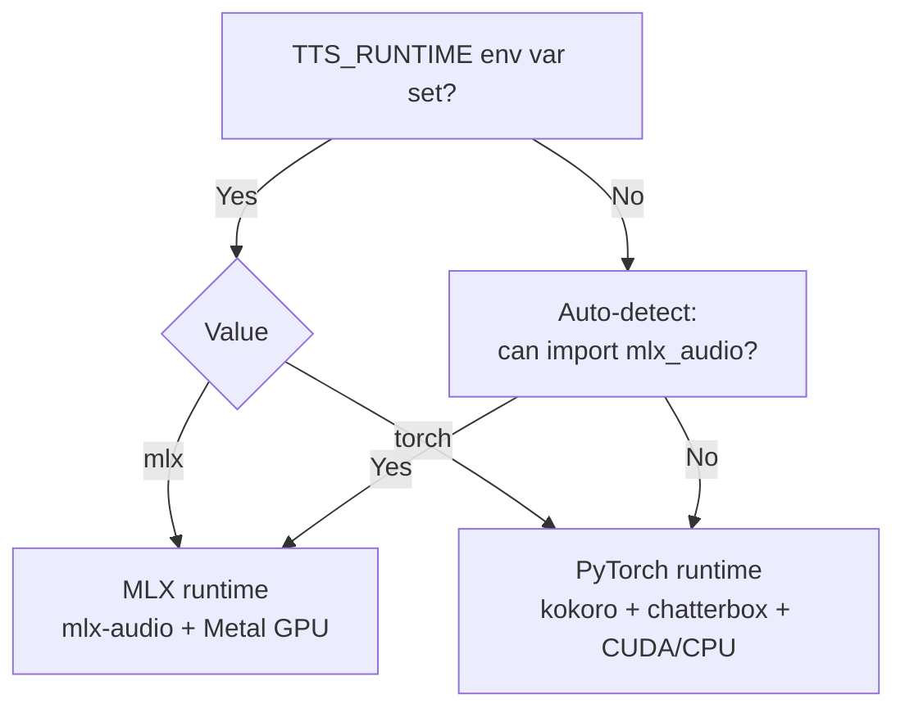
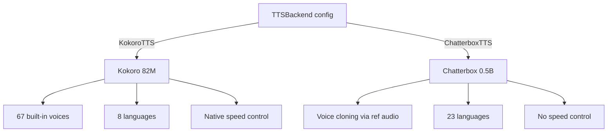

# TTS Backends

Two text-to-speech engines are available — Kokoro and Chatterbox — each with different trade-offs. Both run locally with automatic platform detection:

- **Apple Silicon** → MLX runtime via [mlx-audio](https://github.com/lucasnewman/mlx-audio)
- **NVIDIA CUDA / AMD ROCm / CPU** → PyTorch runtime via [kokoro](https://pypi.org/project/kokoro/) + [chatterbox-tts](https://pypi.org/project/chatterbox-tts/)

The runtime is auto-detected at startup:



Override with the `TTS_RUNTIME` env var:

```bash
TTS_RUNTIME=mlx  uv run python scripts/audiobook.py --input book.pdf
TTS_RUNTIME=torch uv run python scripts/audiobook.py --input book.pdf
```

## Installation

Install the extras for your platform:

```bash
uv sync --extra mlx    # Apple Silicon (MLX) — includes all backends via mlx-audio
uv sync --extra torch  # CUDA / ROCm / CPU (PyTorch) — Kokoro only (see note below)
```

Both can be installed simultaneously — `TTS_RUNTIME` or auto-detection picks the active one.

> **Chatterbox on PyTorch is currently broken.** The `chatterbox-tts` PyPI package hard-pins `transformers==4.46.3`, which conflicts with `transformers>=4.55` required by the torch extra. This means Kokoro and Chatterbox **cannot coexist** in the same PyTorch environment. Community PRs to relax the pin remain unmerged. On **Apple Silicon (MLX)**, this is not an issue — `mlx-audio` bundles Chatterbox without the conflicting pin, so both backends work together out of the box.

### Using both backends on PyTorch

If you want to test both Kokoro and Chatterbox on a PyTorch setup (CUDA / CPU), you need separate virtual environments since they cannot share the same `transformers` version.

```bash
# Environment 1 — Kokoro (transformers>=4.55)
uv venv .venv-kokoro
uv sync --extra torch          # installs kokoro + transformers>=4.55
TTS_RUNTIME=torch uv run python scripts/audiobook.py --input book.pdf

# Environment 2 — Chatterbox (transformers==4.46.3)
uv venv .venv-chatterbox
uv pip install chatterbox-tts  # pulls transformers==4.46.3
TTS_RUNTIME=torch uv run python scripts/audiobook.py --input book.pdf
```

Alternatively, install `chatterbox-tts` with `--no-deps` into the Kokoro environment and hope for the best — Chatterbox may work with newer transformers, but this is untested and unsupported as of the documentation found on the [Chatterbox repo](https://github.com/resemble-ai/chatterbox):

```bash
uv sync --extra torch
uv pip install chatterbox-tts --no-deps
```

On **Apple Silicon**, none of this is needed — just use `uv sync --extra mlx`.

## Comparison

| | Kokoro | Chatterbox |
|---|---|---|
| **Model** | Kokoro-82M (82M params) | Chatterbox (0.5B params) |
| **Languages** | 8 (en, fr, es, hi, it, ja, pt, zh) | 23 languages |
| **Voices** | 67 selectable voices | Voice cloning via reference audio |
| **Voice control** | Pick any voice per speaker, per-voice speed | Reference audio + exaggeration/cfg (no native speed control) |
| **Quality** | Varies by voice (A to D grade) | Natural prosody via voice cloning |
| **Speed** | Fast (82M params) | Moderate (0.5B params) |
| **Auto-selected** | Yes (default when `tts` is omitted) | No |
| **MLX model** | `mlx-community/Kokoro-82M-bf16` | `mlx-community/chatterbox-fp16` |
| **PyTorch model** | `kokoro` PyPI package | `chatterbox-tts` PyPI package (broken — dependency conflict) |

## Language coverage

Eight languages are supported by Kokoro. Chatterbox supports all listed languages plus additional ones.

| Language | Code | Kokoro | Chatterbox |
|---|---|---|---|
| English | `en` | yes | yes |
| Chinese | `zh` | yes | yes |
| French | `fr` | yes | yes |
| Spanish | `es` | yes | yes |
| Italian | `it` | yes | yes |
| Japanese | `ja` | yes | yes |
| Portuguese | `pt` | yes | yes |
| Hindi | `hi` | yes | yes |
| Korean | `ko` | -- | yes |
| German | `de` | -- | yes |
| Russian | `ru` | -- | yes |

## Pipeline compatibility

Both backends support both pipelines:

| Backend | Audiobook | Podcast | How two speakers work |
|---|---|---|---|
| **Kokoro** | Single narrator (1 voice) | Two voices from `voices` pair | Split by `[S1]`/`[S2]` tags, alternate voices |
| **Chatterbox** | Single narrator (1 reference audio) | Two reference audio files | Split by `[S1]`/`[S2]` tags, alternate reference audio |

## Kokoro

The default backend. Lightweight, multilingual, with independently controllable voices.

- **Auto-selection**: When `tts` is not set, `KokoroTTS` is created automatically from `target_lang` with voices from `KOKORO_VOICE_PRESETS`.
- **Voice naming**: `{accent}{gender}_{name}` (e.g. `af_heart` = American female "Heart")
- **Per-voice speeds**: Use `speeds=(0.95, 1.1)` to set different speeds for S1 and S2 in podcast mode.
- **lang_code**: Derived automatically from the first character of the voice name for phonemization.

### Config fields

| Field | Type | Default | Description |
|---|---|---|---|
| `lang` | `str \| None` | `None` | Auto-select voices from `KOKORO_VOICE_PRESETS`. Set by pipeline config from `target_lang`. |
| `voices` | `tuple[str, ...] \| None` | `None` | Voice names. Auto-resolved from `lang` if not set. 1 for audiobook, 2 for podcast. |
| `speed` | `float` | `0.95` | Global speed multiplier. |
| `speeds` | `tuple[float, ...] \| None` | `None` | Per-voice speeds (overrides `speed`). Index matches `voices`. |

### Voice presets

| Language | Female | Male | Notes |
|----------|--------|------|-------|
| `en` | `af_heart` (grade A) | `am_michael` (C+) | American English. British also available (`bf_emma`, `bm_george`). |
| `fr` | `ff_siwis` (B-) | -- | SIWIS corpus. No male voice available. |
| `es` | `ef_dora` | `em_alex` | |
| `hi` | `hf_alpha` | `hm_omega` | |
| `it` | `if_sara` | `im_nicola` | |
| `ja` | `jf_alpha` | `jm_kumo` | |
| `pt` | `pf_dora` | `pm_alex` | Brazilian Portuguese |
| `zh` | `zf_xiaobei` | `zm_yunjian` | Mandarin Chinese |

Quality grades from [Kokoro VOICES.md](https://huggingface.co/hexgrad/Kokoro-82M/blob/main/VOICES.md). 67 voices total across 8 languages.

### Usage

```python
# Auto-selected from target_lang (no tts= needed):
config = PodcastConfig(
    dialogue=DialogueConfig(target_lang="fr"),
    llm=OllamaLLM(...),
)

# Explicit with custom speeds:
config = PodcastConfig(
    dialogue=DialogueConfig(target_lang="en"),
    llm=OllamaLLM(...),
    tts=KokoroTTS(speeds=(0.95, 1.1)),
)

# Explicit with custom voices:
config = PodcastConfig(
    dialogue=DialogueConfig(target_lang="en"),
    llm=OllamaLLM(...),
    tts=KokoroTTS(voices=("bf_emma", "bm_george")),
)
```

## Chatterbox

Multilingual TTS with voice cloning support by [ResembleAI](https://huggingface.co/ResembleAI/chatterbox). Clone any voice from a short reference audio file.

- **23 languages**: Broad multilingual support out of the box.
- **Voice cloning** (untested in this project): The code passes `audio_prompts` through to the underlying model, but this feature has not been end-to-end tested yet. In theory, provide a reference audio file (`.wav`) to clone a voice — one file for audiobook (single narrator), two files for podcast (one per speaker).
- **Emotion control**: `exaggeration` (0.0–1.0) controls emotional expressiveness, `cfg` (0.0–1.0) controls generation guidance. These have indirect effects on pacing but are not precise speed controls.
- **No native speed control**: The model uses a fixed token-to-mel mapping with no duration predictor — speaking rate is determined by the model, not a tunable parameter.
- **No fixed voices**: Without reference audio, uses a default voice.

### Reference voices

Chatterbox needs a short (6–10 s) `.wav` clip of clean speech to clone a voice. A few free sources to get started:

| Source | License | What you get |
|--------|---------|--------------|
| [Chatterbox TTS Server — `voices/`](https://github.com/devnen/Chatterbox-TTS-Server/tree/main/voices) | MIT | 28 ready-to-use WAV files (17 male, 11 female) built for Chatterbox. Download individual files directly from GitHub. |
| [Kyutai tts-voices — `voice-donations/`](https://huggingface.co/kyutai/tts-voices/tree/main/voice-donations) | CC0 | 228 volunteer voices with `*_enhanced.wav` variants (cleaned). Public domain — no attribution required. |
| [Kyutai tts-voices — `vctk/`](https://huggingface.co/kyutai/tts-voices/tree/main/vctk) | CC BY 4.0 | 110 speakers from the VCTK corpus, one curated utterance each. |
| [VCTK Corpus v0.92](https://datashare.ed.ac.uk/handle/10283/3443) | ODC-By 1.0 | 110 English speakers, ~400 sentences each, studio-recorded at 48 kHz. Pick one clean utterance per speaker. |

> **Tip**: The Chatterbox TTS Server voices are the fastest path — download a `.wav` and pass its path to `audio_prompts`.

### Config fields

| Field | Type | Default | Description |
|---|---|---|---|
| `audio_prompts` | `tuple[str, ...] \| None` | `None` | Reference audio paths for voice cloning. 1 for audiobook, 2 for podcast. |
| `exaggeration` | `float` | `0.5` | Emotion exaggeration control. |
| `cfg` | `float` | `0.5` | Classifier-free guidance strength. |
| `lang` | `str \| None` | `None` | Language code (e.g. "en", "fr"). |

### Usage

```python
# Audiobook with voice cloning:
config = AudiobookConfig(
    narration=NarrationConfig(source_lang="en", target_lang="en"),
    llm=OllamaLLM(...),
    tts=ChatterboxTTS(audio_prompts=("voices/narrator.wav",)),
)

# Podcast with two cloned voices:
config = PodcastConfig(
    dialogue=DialogueConfig(target_lang="en"),
    llm=OllamaLLM(...),
    tts=ChatterboxTTS(audio_prompts=("voices/host.wav", "voices/guest.wav")),
)

# Without voice cloning (default voice):
config = PodcastConfig(
    dialogue=DialogueConfig(target_lang="fr"),
    llm=OllamaLLM(...),
    tts=ChatterboxTTS(lang="fr"),
)
```

## Cross-platform details

### MLX runtime (Apple Silicon)

Models are downloaded from Hugging Face's `mlx-community` org as quantized MLX weights. Metal GPU is used automatically.

### PyTorch runtime (CUDA / ROCm / CPU)

- **Kokoro**: Uses the [`kokoro`](https://pypi.org/project/kokoro/) PyPI package with `KPipeline`. Auto-detects CUDA if available, falls back to CPU.
- **Chatterbox**: Uses the [`chatterbox-tts`](https://pypi.org/project/chatterbox-tts/) PyPI package with `ChatterboxTTS.from_pretrained()`. Auto-detects CUDA if available, falls back to CPU. **Currently broken** due to `transformers==4.46.3` hard pin — cannot coexist with Kokoro's `transformers>=4.55` requirement.

All backends output at 24 kHz sample rate.

## Rendering details

A few implementation details shared across backends:

- **Speaker gap**: In podcast mode, 0.3 seconds of silence is inserted between speaker turns for natural pacing.
- **Pause markers**: `[PAUSE_SHORT]` (0.5s), `[PAUSE_MEDIUM]` (1.2s), `[PAUSE_LONG]` (2.0s) are converted to silence arrays at the backend's sample rate. The LLM inserts these during narration/dialogue generation.
- **Lazy model loading**: TTS models are only loaded if there are uncached segments to render. If all audio files already exist on disk, the model is never loaded.

## Backend selection overview

